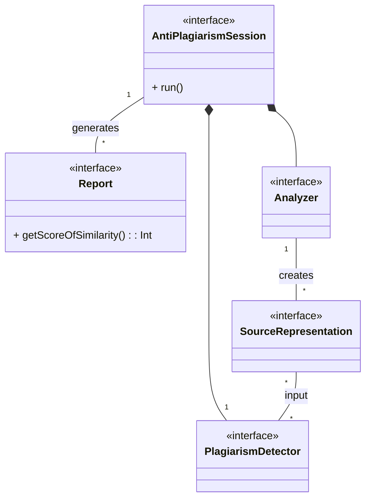
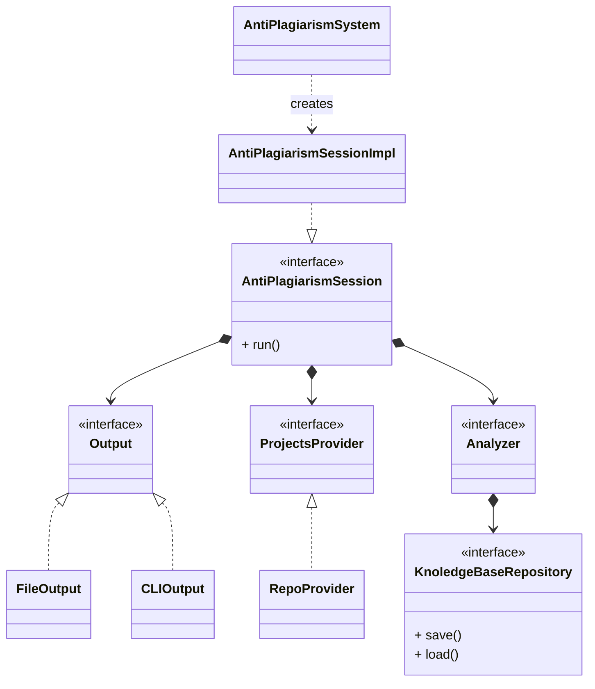

# Code plagiarism detector doc

[Link Github](https://github.com/tassiLuca/code-plagiarism-detector)

## Analisi dei requisiti
Si vuole realizzare un sistema software in grado di trovare eventuali porzioni di codice copiato nei progetti software del corso di OOP dell'Università di Bologna, sviluppati in linguaggio Java.

### Requisiti funzionali
- Il sistema riceve in input un progetto di cui si vuole verificare l'autenticità;
- Il sistema recupera i progetti su cui verificare eventuali plagi (i vecchi progetti sono mantenuti in repo pubbliche archiviate su GitHub e BitBucket);
- Il sistema deve fornire in output un elenco di sezioni di codice che, con un determinato livello di accuratezza, ha stabilito essere simili (laddove presenti);

### Requisiti non funzionali
- Le informazioni estrapolate dai sorgenti sono salvate in modo tale da essere riutilizzate nelle analisi successive di altri progetti;
- L'algoritmo per determinare le similarità deve essere interscambiabile e facilmente estendibile;
- è necessario che il sistema impieghi un tempo "ragionevole" per effettuare la computazione.

### Modello del dominio
Il sistema deve essere in grado, a partire da un insieme di progetti e sorgenti, di estrarne una rappresentazione confrontabile (_SourceRepresentation_), ad esempio i _token_, mediante opportuni algoritmi di analisi (_Analyzer_) e poter determinare eventuali parti di codice duplicato e/o somiglianze, generando dei report.

La principale difficoltà sarà individuare tecniche di analisi lessicali e di rilevamento delle somiglianze che siano robuste, ovvero permettano d'identificare casi di copiature anche se lo sviluppatore ha effettuato modifiche per nasconderle (come ad esempio cambiare identificatori, nomi, l'ordine dei parametri ecc...)
Inoltre, il requisito non funzionale sulle _performance_ richiederà un'analisi dei tempi di esecuzione quando il sistema sarà completato.

## Architettura
`AntiPlagiarismSystem` è l'_entry point_ dell'applicazione ed ha il compito d'istanziare e configurare opportunamente la concreta implementazione di `AntiplagiarismSession` che è la classe responsabile della logica dell'applicazione. 
`AntiPlagiarismSession` rappresenta una specifica sessione, dove per sessione si intende l'oggetto che, una volta configurato con l'apposito _Provider_ e _Output_, esegue la logica dell'applicazione.
Gli `Output` rappresentano le risorse su cui andare a scrivere i risultati ottenuti, mentre il `ProjectsProvider` rappresenta la strategia con cui recuperare i progetti su cui effettuare l'analisi.
L'analisi dei sorgenti viene effettuata dall'`Analyzer` che incapsula la specifica strategia utilizzata e demanda a `KnoledgeBaseRepository` il salvataggio e/o il recupero delle rappresentazioni dei sorgenti già precedentemente analizzati.

Questa architettura permetterebbe facilmente l'aggiunta di un nuovo `Output` e di poter cambiare sia la strategia per recuperare i progetti, sia la logica con cui questi vengono processati.

