# Code plagiarism detector doc

[Link Github](https://github.com/tassiLuca/code-plagiarism-detector)

- [Code plagiarism detector doc](#code-plagiarism-detector-doc)
  - [Analisi dei requisiti](#analisi-dei-requisiti)
    - [Requisiti funzionali](#requisiti-funzionali)
    - [Requisiti non funzionali](#requisiti-non-funzionali)
    - [Modello del dominio](#modello-del-dominio)
  - [Architettura](#architettura)
  - [Design](#design)
    - [ProjectsProvider](#projectsprovider)
    - [Output](#output)
    - [Analyzer](#analyzer)
    - [Configurable Options + AntiPlagirismSession](#configurable-options--antiplagirismsession)

## Analisi dei requisiti
Si vuole realizzare un sistema software in grado di trovare eventuali porzioni di codice copiato nei progetti software del corso di OOP dell'Università di Bologna, sviluppati in linguaggio Java.

### Requisiti funzionali
- Il sistema riceve in input un progetto di cui si vuole verificare l'autenticità;
- Il sistema recupera i progetti su cui verificare eventuali plagi (i vecchi progetti sono mantenuti in repo pubbliche archiviate su GitHub e BitBucket);
- Il sistema deve fornire in output un elenco di sezioni di codice che, con un determinato livello di accuratezza, ha stabilito essere simili (laddove presenti);

### Requisiti non funzionali
- Le informazioni estrapolate dai sorgenti sono salvate in modo tale da essere riutilizzate nelle analisi successive di altri progetti;
- L'algoritmo per determinare le similarità deve essere interscambiabile e facilmente estendibile;
- è necessario che il sistema impieghi un tempo "ragionevole" per effettuare la computazione.

### Modello del dominio
Il sistema deve essere in grado, a partire da un insieme di progetti e sorgenti, di estrarne una rappresentazione confrontabile (_SourceRepresentation_), ad esempio i _token_, mediante opportuni algoritmi di analisi (_Analyzer_) e poter determinare eventuali parti di codice duplicato e/o somiglianze, generando dei report.

La principale difficoltà sarà individuare tecniche di analisi lessicali e di rilevamento delle somiglianze che siano robuste, ovvero permettano d'identificare casi di copiature anche se lo sviluppatore ha effettuato modifiche per nasconderle (come ad esempio cambiare identificatori, nomi, l'ordine dei parametri ecc...)
Inoltre, il requisito non funzionale sulle _performance_ richiederà un'analisi dei tempi di esecuzione quando il sistema sarà completato.

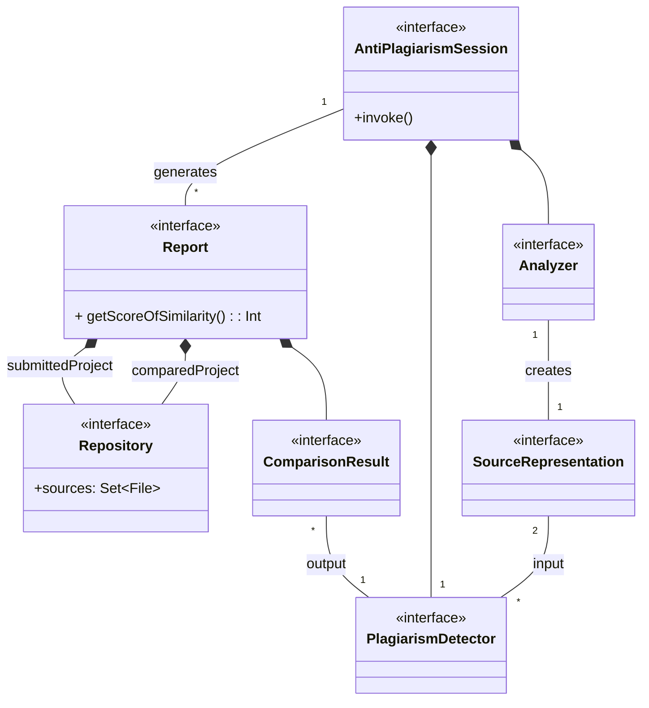

## Architettura
`AntiPlagiarismSystem` è l'_entry point_ dell'applicazione ed ha il compito d'istanziare e configurare opportunamente la concreta implementazione di `AntiplagiarismSession` che è la classe responsabile della logica dell'applicazione. 
`AntiPlagiarismSession` rappresenta una specifica sessione, dove per sessione si intende l'oggetto che, una volta configurato con l'apposito _Provider_ e _Output_, esegue la logica dell'applicazione.
Gli `Output` rappresentano le risorse su cui andare a scrivere i risultati ottenuti, mentre il `ProjectsProvider` rappresenta la strategia con cui recuperare i progetti su cui effettuare l'analisi.
L'analisi dei sorgenti viene effettuata dall'`Analyzer` che incapsula la specifica strategia utilizzata e demanda a `KnoledgeBaseRepository` il salvataggio e/o il recupero delle rappresentazioni dei sorgenti già precedentemente analizzati.

Questa architettura permetterebbe facilmente l'aggiunta di un nuovo `Output` e di poter cambiare sia la strategia per recuperare i progetti, sia la logica con cui questi vengono processati.

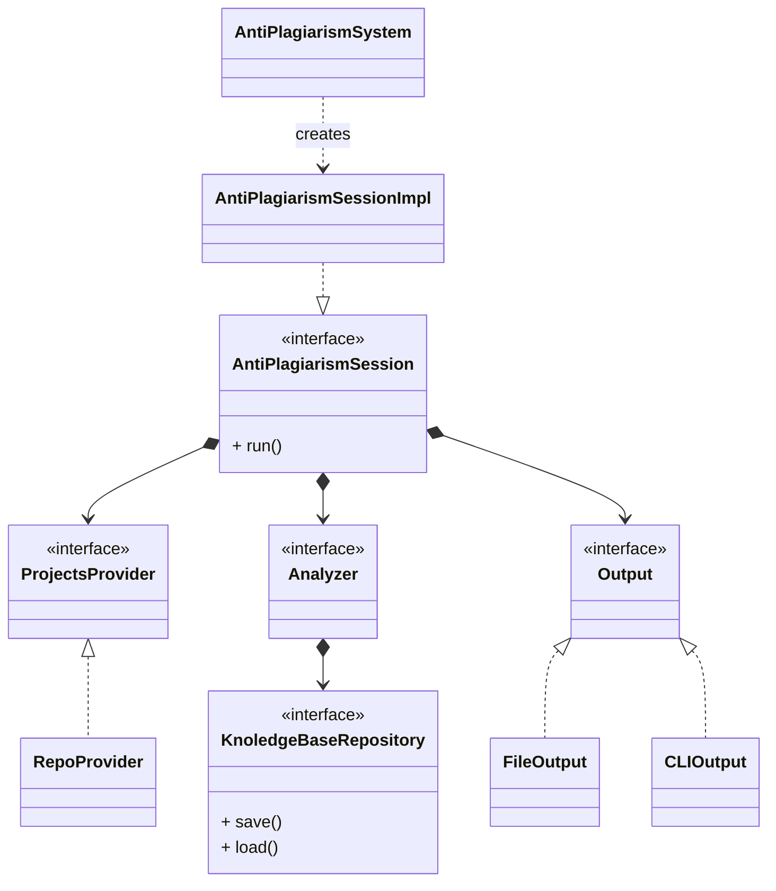

## Design
### ProjectsProvider
  
Componenti:
- `RepositoryProvider`: un generico _provider_ di repository che consente al cliente di richiedere una repository in base al suo link diretto o attraverso un criterio.
- `AbstractRepositoryProvider` cattura l'implementazione comune dei due concreti `GitHub` e `BitbucketProvider`. 
- `TokenSupplierStrategy` è l'interfaccia a cui viene richiesto di recuperare il token di autenticazione ad un servizio. L'implementazione di default ricerca tra variabili d'ambiente.

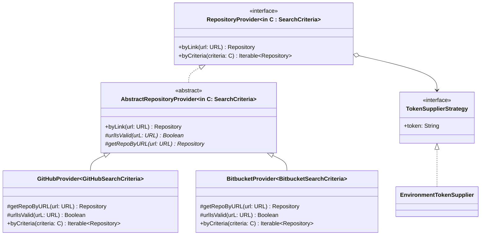

- L'interfaccia `Repository` espone proprietà e metodi per ottenere il suo nome, il suo _owner_ e i suoi sorgenti in base a un dato linguaggio di programmazione. Anche in questo caso `AbstractRepository` cattura l'implementazione comune di `GitHubRepository` e `BitBucketRepository`. 
- La logica di recupero dei repository remoti e dei relativi file è demandata a un'interfaccia via Strategy a `RepoContentSupplierStrategy`: l'implentazione di default (`RepoContentSupplierCloneStrategy`) clona localmente la repo (altri approcci potrebbero essere seguiti, motivo per il quale si è deciso di scorporare in un'interfaccia a sè stante lo specifico algoritmo di recupero del contenuto di una repo).

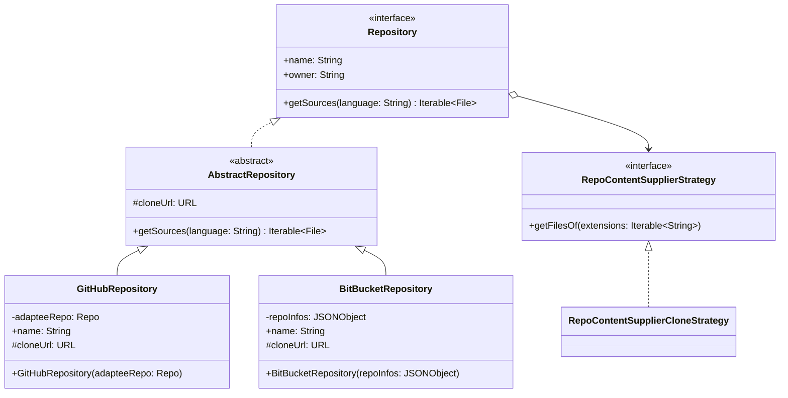

- `SearchCriteria` è un'interfaccia che rappresenta un criterio con cui filtrare le repo.
- Per fare in modo che i criteri siano componibili si è usato un _Decorator_: `GitHubCompoundCriteria`. In questo modo possono essere creati dinamicamente criteri compositi in base alle esigenze (ed è estendibile perché potrebbero essere aggiunti altri criteri di ricerca, come il numero di _stars_ o se archiviata o no...)
- [Link Bitbucket > Filter and sort API objects ](https://developer.atlassian.com/cloud/bitbucket/rest/intro/#filtering)
- [Link GitHub > Searching for repositories](https://docs.github.com/en/search-github/searching-on-github/searching-for-repositories)

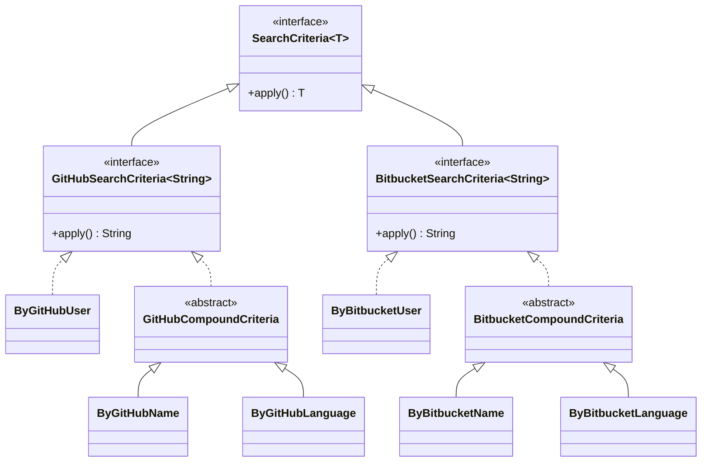

### Output

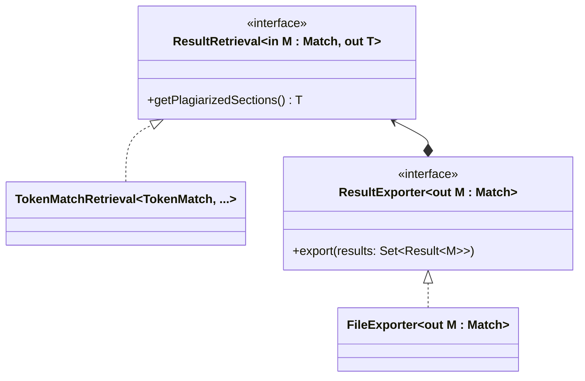

### Analyzer

<!-- italian version:
Viene qui impiegato il pattern [Pipeline](https://java-design-patterns.com/patterns/pipeline/) per modellare la sequenza di trasformazioni che vengono eseguite per passare dal file sorgente alla sua rappresentazione confrontabile.

Il `TokenizationAnalyzerProxy` è l'oggetto intermediario che si occuperà, nel caso in cui quel file sia già stato tokenizzato e memorizzato in precedenza, di recuperarlo senza ri-effettuare la tokenizzazione.
-->

The [Pipeline](https://java-design-patterns.com/patterns/pipeline/) pattern is used to model the sequence of transformations performed to transform a source file into a comparable representation.

`TokenizationAnalyzerProxy` is an intermediary object that manages the recovery of previously analyzed and cached files without having to re-analyse them.

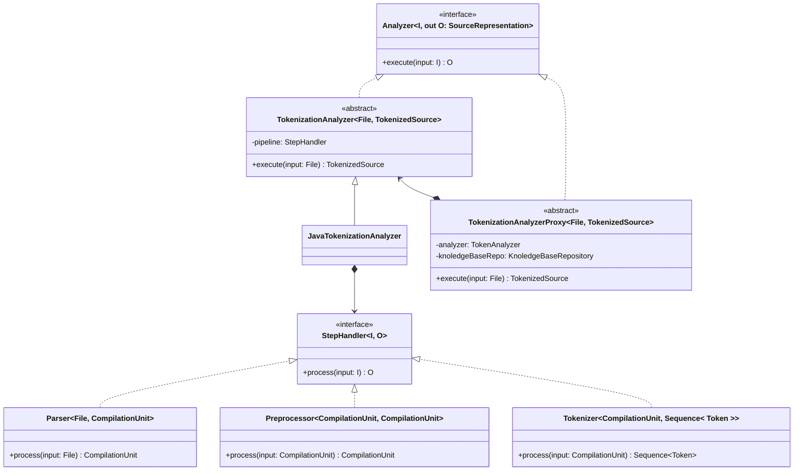

`SourceRepresentation` is the interface modeling the intermediate representation, which is generated from the source file, prior to comparison.
Among available representations, the source code token sequence is the most common one: `TokenizedSource` embodies a token-based representation of the source code, which is a sequence of structure-preserving terms found in the code files.

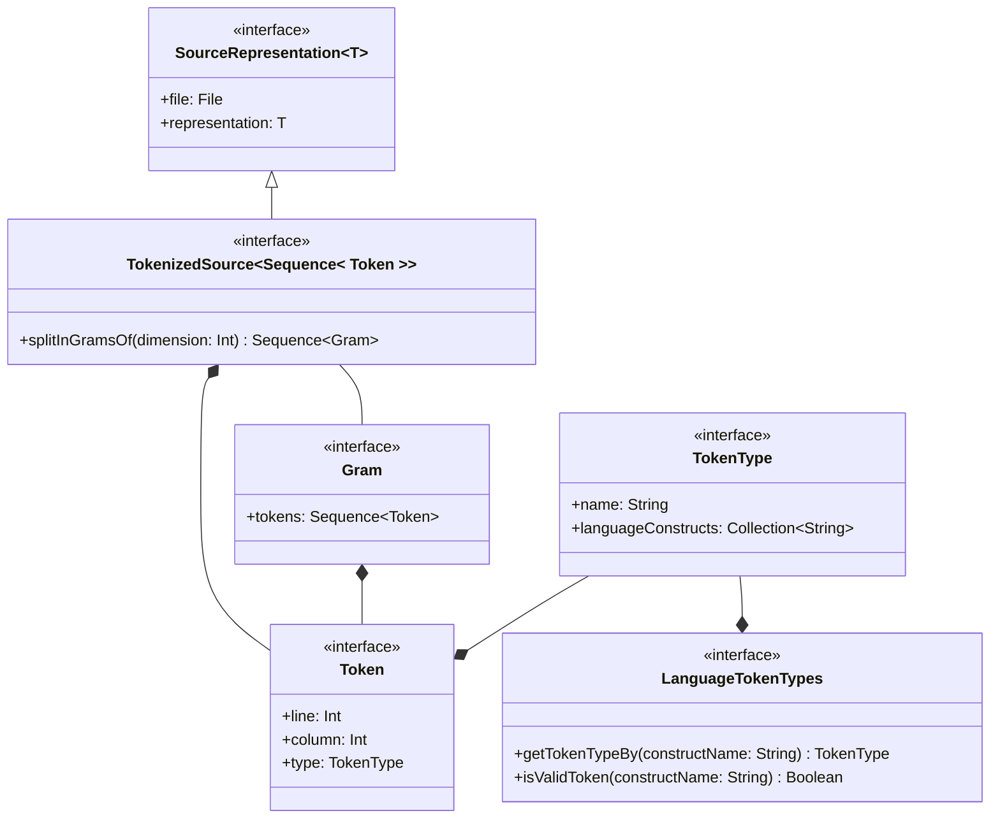
<!-- italian version:
Il `PlagiarismDetector` è la strategia (algoritmo) con cui viene calcolata la similarità tra una coppia di artefatti. 
-->

`PlagiarismDetector` is the component that detects similarities between two `SourceRepresentation`.
`ComparisonStrategy` encapsulates the specific algorithm used to detect the similarities.

`Match` represents two sections of `SourceRepresentation` that are similar.

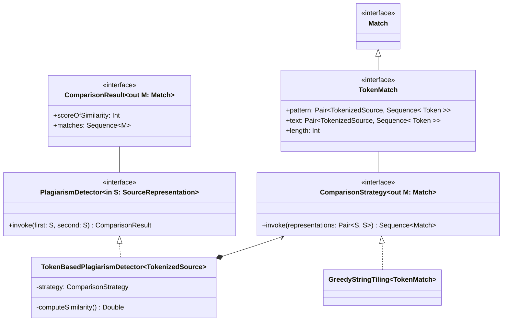

<!-- italian version:
`KnoledgeBaseRepository` è il componente che si occuperà di salvare il risultato del _processing_ dei sorgenti in modo tale da poter riutilizzarli in un secondo momento senza dover rifare l'analisi.
-->

**[TODO]** `KnoledgeBaseRepository` is the component that will take care of saving/loading the results of project sources processing so that they can be reused at a later time without having to be re-analyzed

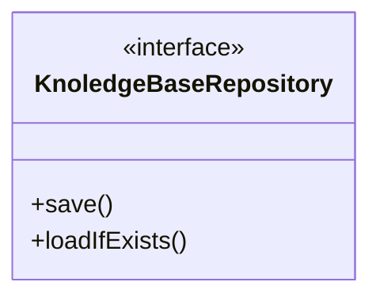

### Configurable Options + AntiPlagirismSession

----
- **Positional arguments (A)**: 
  - **provides information to either the command or one of its options** (`-o file`)
  - advantage of being able to accept a variable number of values
  - commonly used for values like file paths or URLs or for required values
- **Options (O)**
  - follows Unix conventions: use options for most parameters
  - are limited to a fixed number of values
  - **modify the behavior of the command** (e.g. `-v`: verbose)
  - Can 
    - acts as flags (don't have to take values)
    - prompt for missing input
    - load values from environment variables
  - commonly used for "everything else"
- **Subcommands**: functions / (low-level) commands, which are used with "metacommands" that embed multiple separate commands, like `git status -s` - `status` is the subcommand and `-s` is an option of the subcommand

----

- `--minimum-tokens`: The minimum token length which should be reported as a duplicate;
- `--minimum-duplication-percentage`: the percentage of duplicated code in a source file under which are not reported;
- `--provider`: the providers of projects (sources);
  - Corpus provider: provider of projects to compare with
    - hosting service
      - github / bitbucket
      - search criteria
    - path to directory where find projects
  - Submission provider: provider of the project to analyze
    - URL 
    - path to directory where find the project
- `--output-format`: report format - a set of possible choices;
- `--output-dir`: the directory where to store the result
- `--language`: Sources code language (?);
- `--verbose`: Debug mode (?);
- `--exclude`: Files names to be excluded from checks (for example `Pair.java`).

(da aggiungere autenticazione ai provider?)

```bash
./cpd submission-provider --origin <URI> corpus-provider --minimum-tokens <INT> --minimum-duplication-percentage <INT> --output-format <HTML/...> --output-dir <PATH> --language <?> --verbose --exclude <FILE_NAMES> 
```

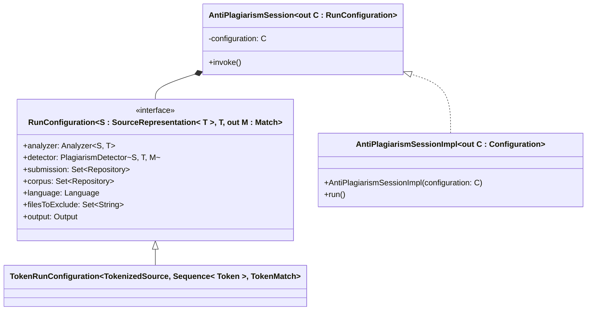


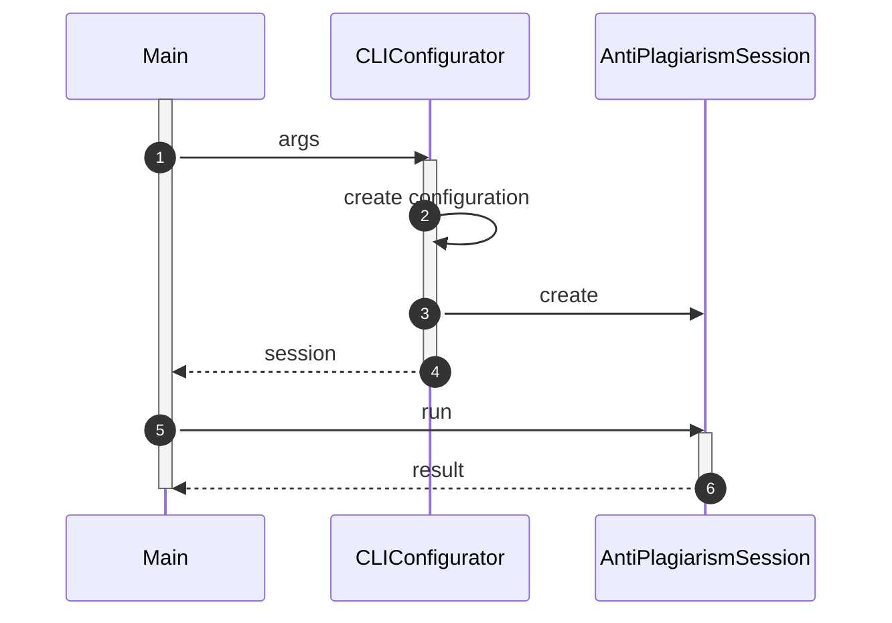

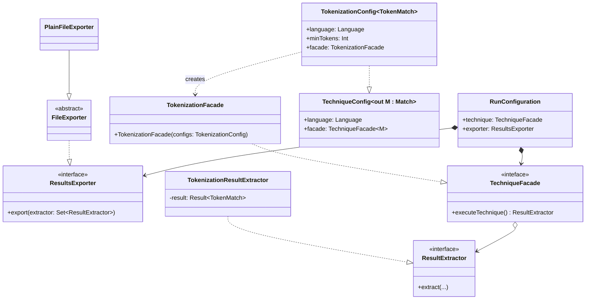
